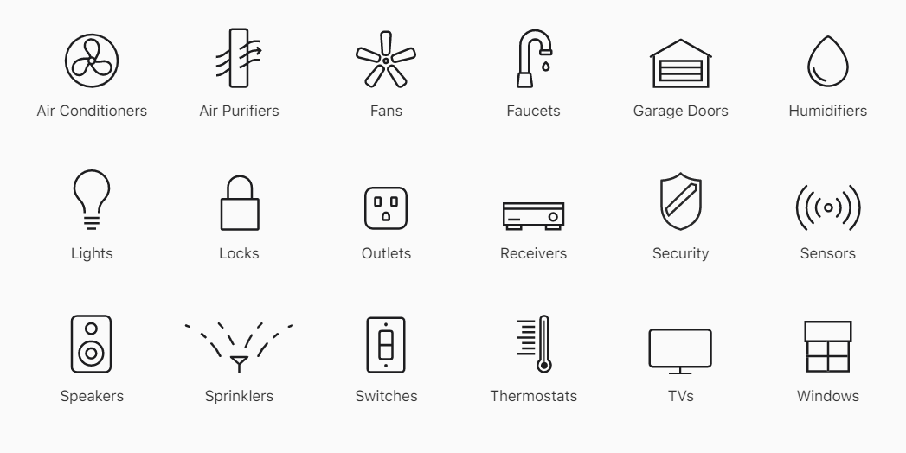
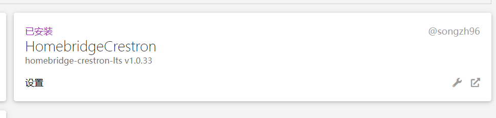
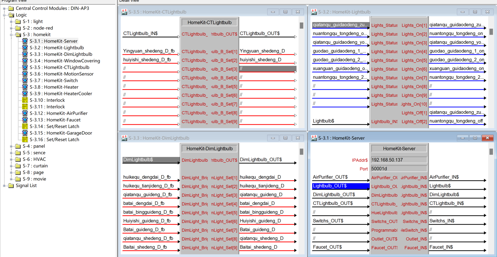
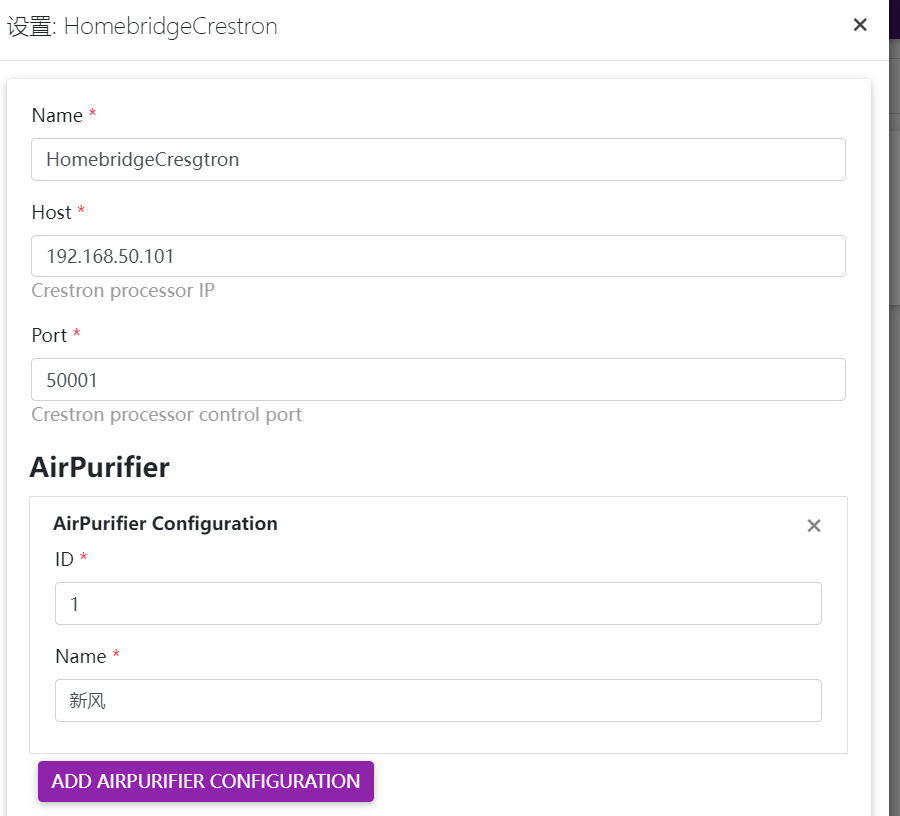
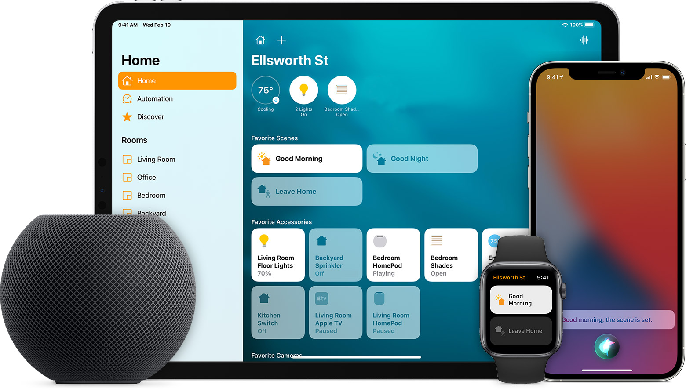

    

# Homebridge Crestron LTS

## Homebridge plugin for crestron
Copyright © 2022 Songzh. All rights reserved.

### Introduction
This [Homebridge](https://github.com/homebridge/homebridge) plugin exposes to Apple's [HomeKit](http://www.apple.com/ios/home/) devices (lights, plugs, sensors, switches, ...) and virtual devices on a Crestron professor.
Homebridge Crestron communicates with TCP.

### Supported Homekit Devices

  

### HARDWARE Prerequisites
1. Raspberry(Or other devices that can install homebridge, such as NAS, Win, MAC...)
2. Crestron Professor(Series 3 and Series 4 mainframes supporting SIMPL programming)

### SOFTWARE Prerequisites
1. install Homebridge [Raspberry OS](https://github.com/homebridge/homebridge/wiki/Install-Homebridge-on-Raspbian)
2. install homebridge-crestron-lts
    
3. Download Crestron macro files on the release page
4. Programming in SIMPL
    
5. Upload the program to your Crestron professor
6. Configure devices in homebridge
   
7. Save config and then restart homebridge
8. Add Device to Homekit
9. Have FUN
  
